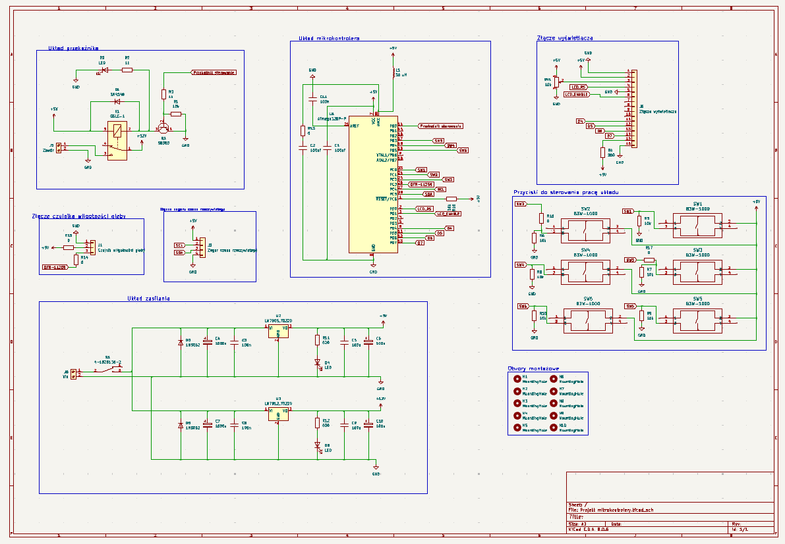
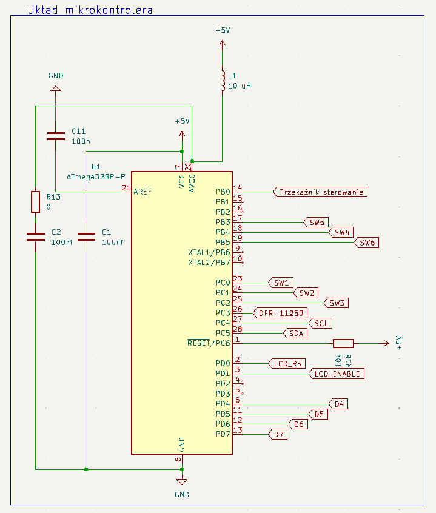
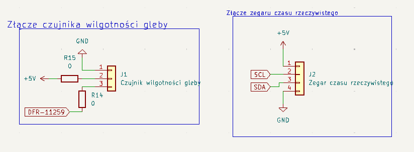
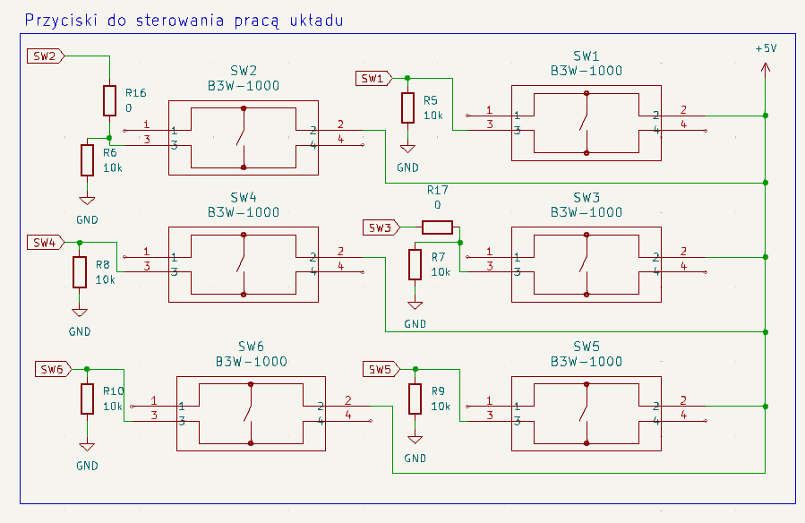
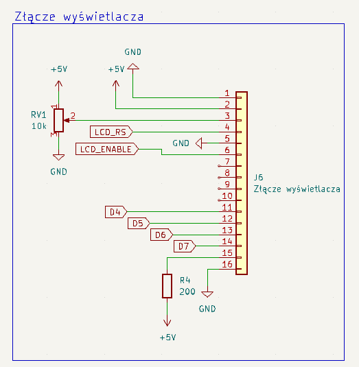
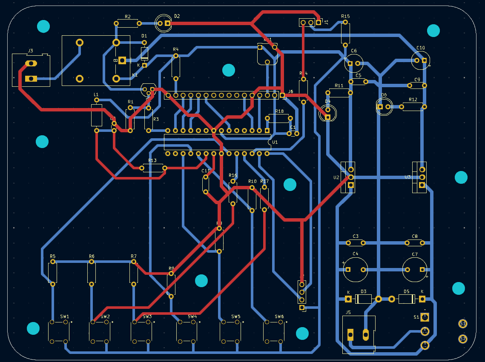

# Projekt-z-zajec-projektowych-z-przedmiotu-Sterowniki-Mikroprocesorowe
Jest to projekt płytki PCB wykonany na potrzeby zajęć projektowych z przedmiotu "Sterowniki Mikroprocesorowe"
Tematem zajęć było zaprojektowanie płytki PCB wykorzystującej mikrokontroler do sterowania elementem wyjściowym. Projekt był projektem grupowym, w grupie pracą podzieliliśmy się tak że, ja projektowałem PCB, inna osoba lutowała cały układ i pisałą dokumentacje, a trzecia osoba pisała kod.
Jednym z założeń projektu było wykonanie fizycznej płytki a nie tylko schematów.
Zgodnie z założeniami zaprezentowanymi przez prowadzącego trzeba było wykorzystać dowolny mikrokontroler, przynajmniej dwa urządzenia wyjściowe oraz urządzenia wejściowe.
Zaprojektowany układ steruje zaworem, poprzez mikrokontroler w postaci Atmegi 328p oraz układu przekaźnika. Układ wyposazony jest rónież w zegar RTC oraz czujnik wilgotności gleby, tak aby na podstawie danych z tych czujników można było sterować pracą zaworu. Układ posiada rónież wyświetlacz na którym można wysiwetlić dowolne parametry, na przykład ile czasu upłyneło od ostatniej aktywacji zaworu czy poziom wilgotności gleby. Dodatkowo układ posiada przyciski pozwalające na kontrolowanie pracy układu.

